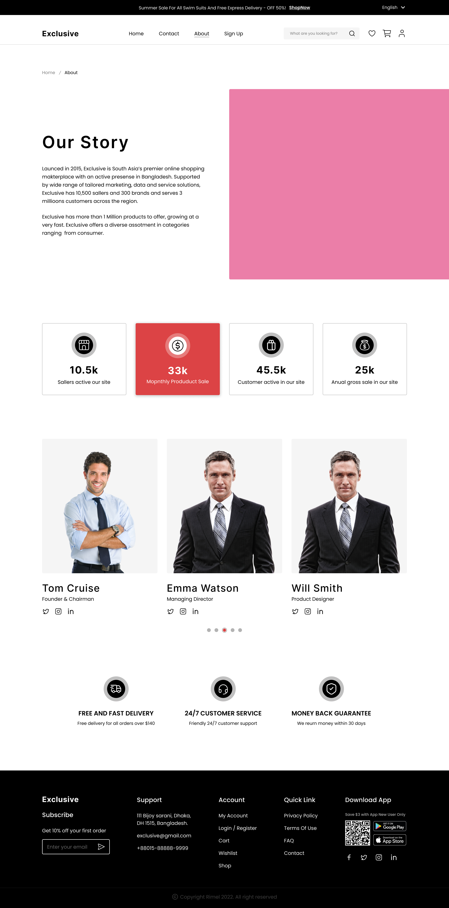
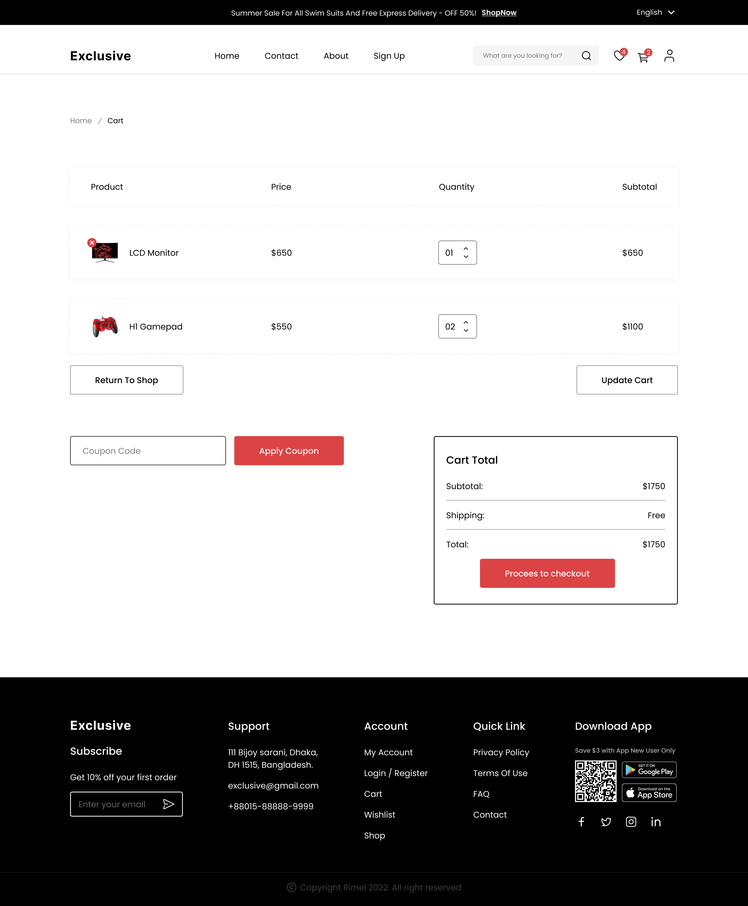
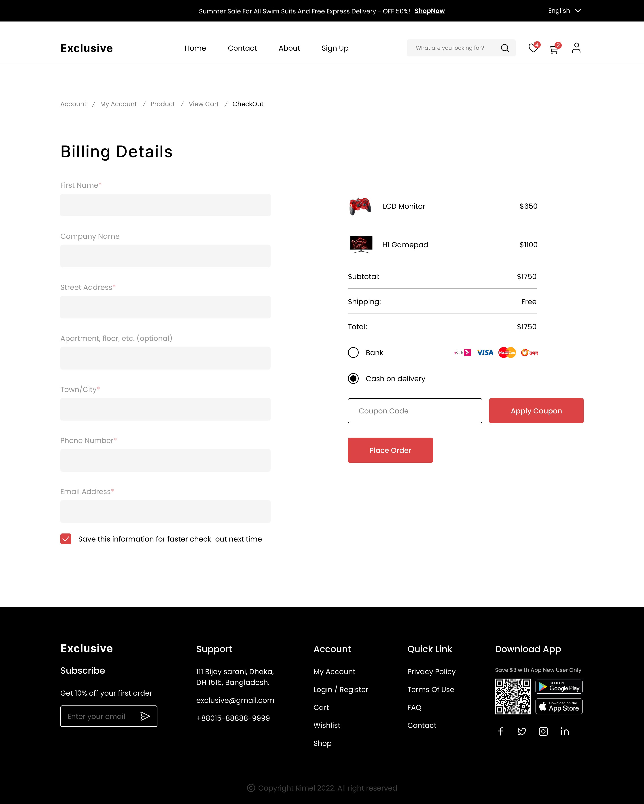
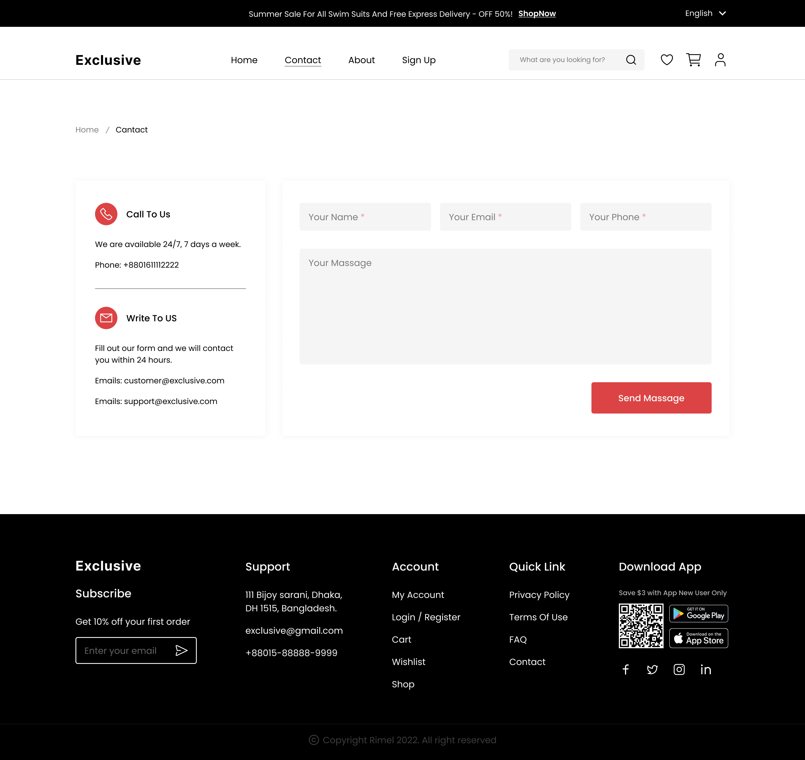

# E-Commerce Website

The E-commerce website is a full-stack application built using React with Vite as the bundler. It incorporates Tailwind CSS for styling and Material UI for components, offering a sleek and modern user interface. The platform provides essential functionalities such as signup and login for users to access their accounts, wishlist and cart pages for managing items, search functionality to easily find products, and a profile section for personalization. Furthermore, it includes checkout processes with support for coupons and purchasing, ensuring a seamless shopping experience for customers.

## [⚡️Design on Figma ⚡️](https://www.figma.com/file/yn2DFQJla0UiSMvomFsqwT/E-Commerce-Website-%D9%90Almdrasa?type=design&mode=design&t=fqPRRAQH5lDJGmoY-0)

## Table of Contents

- [Features](#features)
- [Technologies Used](#technologies-used)
- [Set Up ](#set-up)
- [Screenshots](#screenshots)
- [Contact](#contact)

## Screenshots
1. E-Commerce HomePage
  

2. Sign Up
  

3. Log In
  

4. Product Details page
  

5. Wishlist
  

6. About
  

7. Cart
  

8. CheckOut
  

9. Contact
  

10. Account
  

## Contact

- [Author](https://github.com/Ah-Fayyad/)
- [Email](ahfayyad.m@gmail.com)
- [LinkedIn](https://www.linkedin.com/in/ahmed-fayyad-97a727265?trk=contact-info)