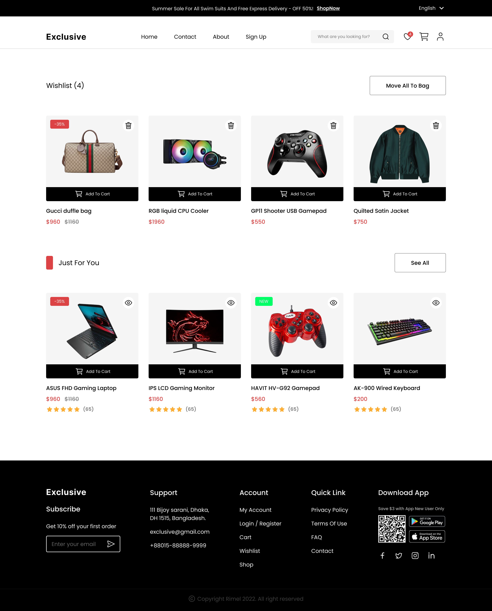

# E-Commerce Website

A **full-stack E-Commerce platform** built with **React**, **Vite**, **Tailwind CSS**, and **Material UI**, leveraging **Supabase** for backend services (authentication, database, and storage). The website offers a modern, responsive UI with a smooth shopping experience.


## [⚡️Design on Figma ⚡️](https://www.figma.com/file/yn2DFQJla0UiSMvomFsqwT/E-Commerce-Website-%D9%90Almdrasa?type=design&mode=design&t=fqPRRAQH5lDJGmoY-0)


## Table of Contents

- [Features](#features)
- [Technologies Used](#technologies-used)
- [Set Up](#set-up)
- [Screenshots](#screenshots)
- [Contact](#contact)

---

##  Technologies Used 🛠

- **Frontend**: React, Vite, Tailwind CSS, Material UI  
- **Backend**: Supabase (Auth, Database, Storage)  
- **Routing**: React Router DOM  
- **State Management**: Context API for cart and wishlist  
- **Deployment**: Vercel 

---

## Screenshots

1. **Home Page**  
   

2. **Sign Up**  


3. **Log In**  
  


4. **Product Details**  
  


5. **Wishlist**  
  


6. **About Page**  
  


7. **Cart Page**  
  


8. **Checkout Page**  
  


9. **Contact Page**  
  


10. **Account Page**  
  


##  Setup Instructions ⚙️


1. Install the project :

   ```bash
   npm install
   ```

2. Start the development server:
   ```bash
   npm run dev
   ```


## Contact

- [Author](https://github.com/Ah-Fayyad/)
- [Email](ahfayyad.m@gmail.com)
- [LinkedIn](https://www.linkedin.com/in/ahmed-fayyad-97a727265?trk=contact-info)